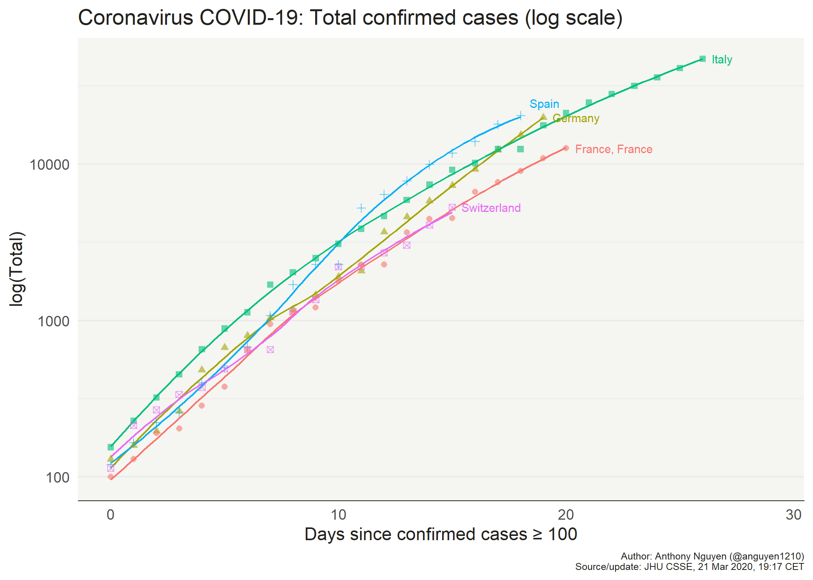

## COVID-19 Tracker  
    
This repo contains the code for the shiny app found at:
  
> [https://mentalbreaks.shinyapps.io/covid19/](https://mentalbreaks.shinyapps.io/covid19/)
  
The [global data](https://github.com/CSSEGISandData/COVID-19) for this app is provided by the Johns Hopkins Center for Systems Science and Engineering (JHU CSSE). Additional information about the data and its collection is available on the [JHU CSSE 'Mapping 2019-nCov' blog post](https://systems.jhu.edu/research/public-health/ncov/).      
    
The [U.S. data](https://github.com/nytimes/covid-19-data) is provided by the New York Times. Additional information about the data and its collection is available in [the accompanying NYT article]()https://www.nytimes.com/article/coronavirus-county-data-us.html.

Population data taken from the [World Bank WDI database](https://databank.worldbank.org/source/world-development-indicators), current as of 2018.  

[Australian territory population data](https://www.abs.gov.au/ausstats/abs@.nsf/Latestproducts/3101.0Main%20Features3Sep%202019?opendocument&tabname=Summary&prodno=3101.0&issue=Sep%202019&num=&view=) provided by the Australian Bureau of Statistics.
 
[Canada province population data](https://www150.statcan.gc.ca/t1/tbl1/en/tv.action?pid=1710000901) provided by Statistics Canada.

[China province population data](https://en.wikipedia.org/wiki/Provinces_of_China) taken from Wikipedia-

For additional background, and to leave comments or suggestions, please visit [my blog](https://mentalbreaks.rbind.io/posts/covid-19-tracker/).  
  
Additional features and edits will be added on an ongoing basis.  
  
All comments, suggestions and pull requests welcome.  
  
    
  

